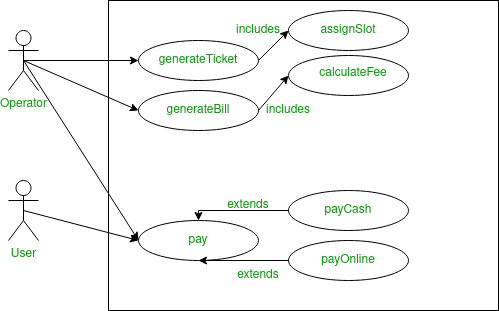
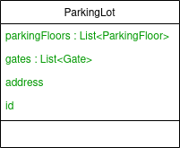
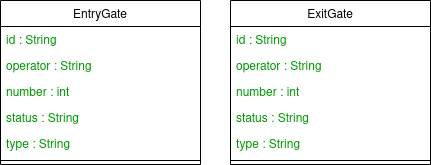
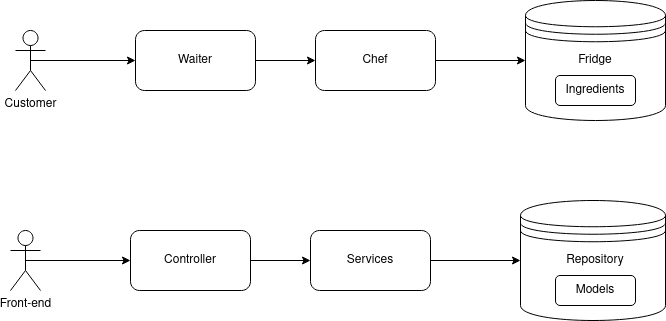

# Design ParkingLot

When faced with a low level design problem, we need to start with an overview of the problem.

## Overview

The purpose of getting an overview is to determine the system we need to design. In this case, we need to understand what a parking lot means. 

There can be two situations here, we either know the system or we don't. If we know the system, we need to describe the system to check if we are thinking of a similar system, or, if we need to make modifications or additions to the system that we know. If we do not know the system, we need to know what the entity/subject is. Then we need to figure out the type of system we need to build. The various kinds of system are designing an entity, a management system, an interactive single user application, a web application, an engineering application like an LRU cache. 

In this case, we will build a management system. This system will be similar to ones that we see in places like shopping centers, hospitals and other public places like them where there is a paid car parking lot. When we enter the parking lot, we get a ticket and we go park the car. When exiting the parking lot, we pay depending on the time spent in the parking lot.

The management system will keep information about the slots that are already filled, will create a ticket at entry, will calculate the parking fee at exit etc. This is the type of system we need to design.

## Gathering Requirments

Now that we have decided the kind of system to design/build, we need to gather the features that we want to incorporate in the system. Visulizing the system in our minds eye will help us come up with ideas. When coming up with ideas, we need to think about the ways in which they will affect the design. We should consider those ideas/features that will impact the design of the parking lot.

1. The parking lot will have multiple floors. 

2. There will be multiple entry and exit points. 

3. The parking lot will support multiple type of vehicles.

4. At entry a ticket is created and issued. 

5. We want to assign a spot at entry. A vehicle will be assigned a spot that supports that vehicle type.

6. Payment has to happen at exit. We can use differet modes of payment like cash and online. In online payment we will use razorpay for which we will only store a razorpay id.

7. Store the details of the operator at the gate.

8. The ticket should have vehicle information.


## Clarifying Requirements

These are usually questions about how the features are going to work. 

1. We should support multiple ways to assign a spot. There could be random spot assigning strategy, nearest to the entry spot assign strategy, cheapest spot assignment strategy.

2. How is the payment going to be calculated? The bill can be a function of the type of vehicle and the duration in the car park.

3. Payment can be split into multiple modes if required. 

4. There might be different ways to calculate fees in the future.

5. For different types of vehicles, there is different base price for the first unit of duration. For different types of vehicles, there is a different multiplier for each time range.

6. For electric vehicles, bill will include both parking and charging costs.

## Use Case Diagram

This system will be used by multiple people, so we need a use case diagram.



## Class Diagram

The two ways to approach the class diagram is to

1. Track the nouns in the requirements.

2. Visualization. We have to visualize from the outermost layer to the innermost layer.

Here we start with a ParkingLot class because that is the outermost layer. The ParkingLot class wil have a list of parkingFloors, list of gates, location address and id (for persisting).



The list of gates will contain all the gate objects. Should there be two different gate classes, one for entry and other for exit? Let us look at the attributes inside the gate class and check if they differ between an entry and exit gate.

Before we compare, we should take a brief look at the MVC patter. All the entities in the system will go into models. Models will have only the details of the entities. No behaviour goes into the models. Behaviours are usually in th controller or service. 

Given, let us look at the details of an entry gate and exit gate will store.



The attributes in both are the same. So we can make one class for both entry and exit gate.

The ParkingFloor class will have an id, list called parkingSpots and floor number. It can have capacity as well or a map of vehicle type and associated capacity. However this is redundant as we can get capacity information from the parkingSpots list. We should add redundancy only when if it improves efficiency. This is dependent on access pattern. If we need to access capacity regularly, then it will be a good idea to add it as an attribute.

The ParkingSpot will have an id, vehicleType, status. This class can also have an ElectricSpot child class which will have one attribute called meter. This will be an object of the Meter class which will have an id, a consumption attribute which will either be of integer data type, or a list of consumption objects of the consumption class. The Consumption class will have an id, startTime, endTime and units consumed. The consumption attribute will be an integer if the use case is limited to only bill generation. However, if we want to store the historical data of the meter, then we need a list of consumption objects. The status attribute in the parking lot will take values like AVAILABLE, UNAVAILABLE, OCCUPIED.

The Operator class will have an id and name. The Vehicle class will have id, vehicleNumber, vehicleType. The Ticket class will have an id, entryTime, operator, parkingSpot, vehicle, gate, status (PAID, UNPAID). The Bill class will have id, ticket, exitTime, amount, operator, gate, payment (list), status (UNPAID, PARTIALLY PAID, FULLY PAID). The payment will be an object of the Payment class. The Payment class will have attributes like id, mode, referenceID, amount, status (FAILED, SUCCESS, PENDING). As bill has status, we can remove the status from the ticker class.

We need interfaces for strategies. Strategy design pattern will be used to implement slot assignment and bill calculation.

This system will potentially be used by multiple parking lots around the world. Each parking lot will have different base rates, different multipliers. In order to set this, the client should have the ability to assign the rates. So these attributes will be base, multiplier and both of them will be maps with vehicleType as key and price and multiplier as values. These attributes will be part of the ParkingLot class.

These are the models that we will use to build up our system.

## MVC Structure



Repositories are also called data access objects (DAO). These are objects that we can use to access data in database.

Abstract Class called Base Model will represent the common attributes of the entities like id, createdAt, lastModifiedAt etc. All the models will extend the Base Model.

All the models should have private attributes and getters and setters for each attribute.

The way to start is to implement use cases one-by-one. We will begin with the createParkingLot use case. Here the model involved is ParkingLot. Once a model has been identified, we will create a controller, service and a repostiory around it.

ParkingLotController is going to be the interface of the application for the client. The functionality that we want to expose to the client is createParkingLot(). To start with, we can create a parking lot with just the address. We can have seperate APIs, to intialize the other attributes of the model, that the client can use subsequently.

```
createParkingLot(String address) {}
```
Even though we are asking for address, as a string, from the client, in the future this can change. We could make address another class or we could add more attributes to ParkingLot. In any API documentation, we have seen them specify the request parameters we need to provide for the request object. Rather than making the controller take input directly, the suggested way is to use data transfer objects (dto). These will be used for both request and response parameters. For every API that is exposed, we will create a request and response object.
```
public class ParkingLotController {

    ParkingLot createParkingLot(CreateParkingLotRequestDto request) {
        
    }
}

public class CreateParkingLotRequestDto {
    private String address;
    
}
```
A dto will differ from the model it represents depending on the requirements of the dto.

Currently the return type of the function createParkingLot should be the response dto.
```
public class CreateParkingLotResponseDto {
    private ParkingLot parkingLot;

    public ParkingLot getParkingLot() {
        return parkingLot;
    }

    public void setParkingLot(ParkingLot parkingLot) {
        this.parkingLot = parkingLot;
    }
}
```

Controllers should be lightweight. A controller will take the request, will fetch information from the request object, and will call the relevant services.

How will ParkingLotController call the ParkingLotService? We will have to inject the service via the constructor of the controller.
```
public class ParkingLotController {

    private ParkingLotService parkingLotService;

    public ParkingLotController(ParkingLotService parkingLotService) {
        this.parkingLotService = parkingLotService;
    }

    CreateParkingLotResponseDto createParkingLot(CreateParkingLotRequestDto request) {
        return null;
    }
}
```
In an interview setting, this is a lot of work. So the following is also fine.
```
public class ParkingLotController {

    private ParkingLotService parkingLotService = new ParkingLotService();

    // public ParkingLotController(ParkingLotService parkingLotService) {
    //     this.parkingLotService = parkingLotService;
    // }

    CreateParkingLotResponseDto createParkingLot(CreateParkingLotRequestDto request) {
        return null;
    }
}
```

Services, on the other hand, should never take a dto. Services are used by multiple clients. So, service methods should never be tightly coupled to one particlar request, as this service can be used for multiple requests. 

Services need the parameter that is required to perform the service. In the case of createParkingLot method in the ParkingLotService class, we need address as the parameter as that is the attribute required to create an object of the ParkingLot class. In case we need more attriutes to instantiate the object at a future date, we will make changes to the createParkingLot method in the service class. The service method will return the object of ParkingLot.
```
public class ParkingLotService {
    ParkingLot createParkingLot(String address) {
        ParkingLot parkingLot = new ParkingLot();
        parkingLot.setAddress(address);
    }
}
```
Now that the object has been constructed, we need to save the object in the database. This is where we interact with the repository layer.
```
public class ParkingLotRepository {
    List<ParkingLot> parkingLots = new ArrayList<>();
    private long nextId = 0;
    ParkingLot save(ParkingLot parkingLot) {
        parkingLot.setId(this.nextId);
        this.nextId += 1;
        this.parkingLots.add(parkingLot);

        return parkingLot;
    }
}
```
ParkingLotRepository, ParkingLotService, ParkingLotController will all be a singleton. Creating a singleton without a framwork is difficult. So in an interviw setting, make these classes static as a substitute for singleton.

There are some good practices with respect to response. All the API's will atleast have a status and data. Whatever is inside the data is what we return.
```
{
    "status":_________,
    "data" :{
        "parkingLot":parkingLot,
        "daysSinceExistence":_________,
    }
}
```
How can we ensure that all the responses given by the API will have this format?

We have to create a base response dto.
```
public class ResponseDto<T> {
    private String status;
    private T data;

    public String getStatus() {
        return this.status;
    }

    public void setStatus(String status) {
        this.status = status;
    }

    public T getData() {
        return this.data;
    }

    public void setData(T data) {
        this.data = data;
    }
}
```
The T is a generic data type that we can provide when instantiating an object.

Then the controller will look like this.
```
public class ParkingLotController {

    private ParkingLotService parkingLotService = new ParkingLotService();

    // public ParkingLotController(ParkingLotService parkingLotService) {
    //     this.parkingLotService = parkingLotService;
    // }

    public ResponseDto<CreateParkingLotResponseDto> createParkingLot(CreateParkingLotRequestDto request) {
        ParkingLot parkingLot = parkingLotService.createParkingLot(request.getAddress());
        CreateParkingLotResponseDto response = new CreateParkingLotResponseDto();
        response.setParkingLot(parkingLot);

        ResponseDto<CreateParkingLotResponseDto> baseResponse = new ResponseDto<>();
        baseResponse.setStatus("Success");
        baseResponse.setData(response);
        return baseResponse;
    }
}
```
This way the response is always standardized. This makes life front-end developers easy as they can check the status of the response before doing anything. 

This structure can now be replicated for all other use cases as well.

## Schema Design

Schema design happens after class diagram. This is because the classes become the tables in the schema design.

We have to start with making the tables of entities. The columns of these tables will be the primitive data types. The names of the tables are plural of the class names.
```
parkingLots
id      |       address

parkingFloors
id      |       floorNumber

parkingSpots
id      |       spotNumber

electricParkingSpots
id      |       spotNumber
```

Due to inheritance/extension, two tables have the same column. This is redundancy as both table have the same set of attributes. Ideally, we would want electricParkingSpots table to have id and the parkingSpots id.

To make this change, we will change the relationship between parkingSpot and electricParkingSpot from is-a to has-a. The electricParkingSpot will now look like this.
```
public class ElectricParkingSpot extends BaseModel {
    private ParkingSpot parkingSpot;
    private ElectricCharger electricCharger;

    public ElectricParkingSpot(ElectricCharger electricCharger) {
        this.electricCharger = electricCharger;
    }
}
```
Now the electicParkingSpots table will only have the id column as the column that is a primitive attribute.
```
parkingLots
id      |       address

parkingFloors
id      |       floorNumber

parkingSpots
id      |       spotNumber

electricParkingSpots
id

gates
id      |       number

electricChargers
id      |       consumption

invoices
id      |       amount

operators
id      |       name

payments
id      |       referenceNumber     |       amount

tickets
id      |       entryTime       |       ownerName

vehicles
id      |       number
```

There are two ways to store enums in a database. 

1. Consider enums as strings. If we do this, in every table there will be a type column indicating the the type the associated record this. However, this will lead to redundancy.

2. Every enum gets its own table. The different types get an id associated with it. Rather than storing the type in the tables, we can now store the id associated with the enum value. This will slow down the queries a bit as we will have to do joins to get the type value.

After representing the primitive attributes, we have to start with the non-primitive attributes.

To represent non primitive datatypes, we have to find the cardinality of the relationship. For example parkingFloor is related parkingLot. 1 floor can have 1 parkingLot. 1 parkingLot can have many floors. So the relationship is 1:m. The id of side with 1 will be in the side with many. So, parkingFloor will have id of parkingLot in it. Similarly parkingLot and gates have a 1:m relationship. So we put the id of parkingLot in the parkingLotId column of the gates table. ParkingFloor and ParkingSpot has a 1:m relationship. So parkingSpots table will have a column called parkingFloorId. The relationship between ParkingSpot and VehicleType is m:1. So we put the vehicleTypeId in a column in the parkingSpots table. The relationship between ElectricParkingSpot and the ParkingSpot is 1:1. We can put the parkingSpotId in the electricParkingSpots table.

